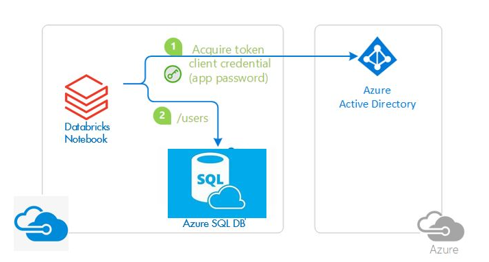
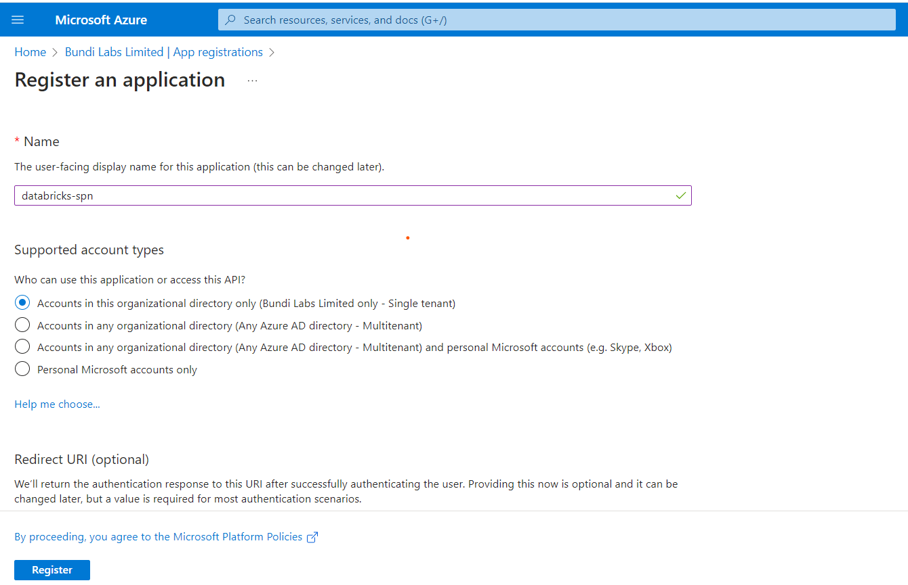
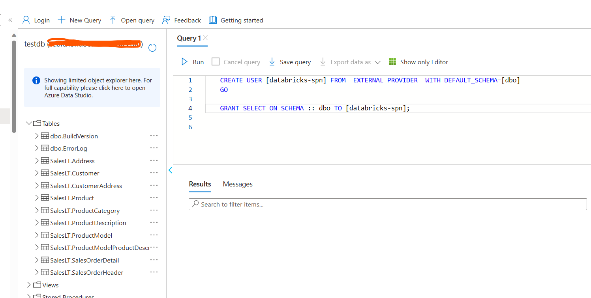
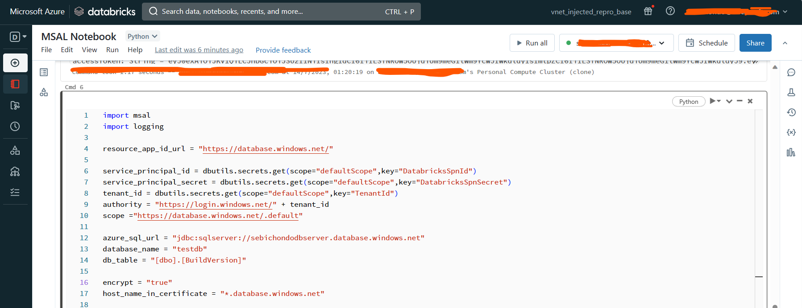
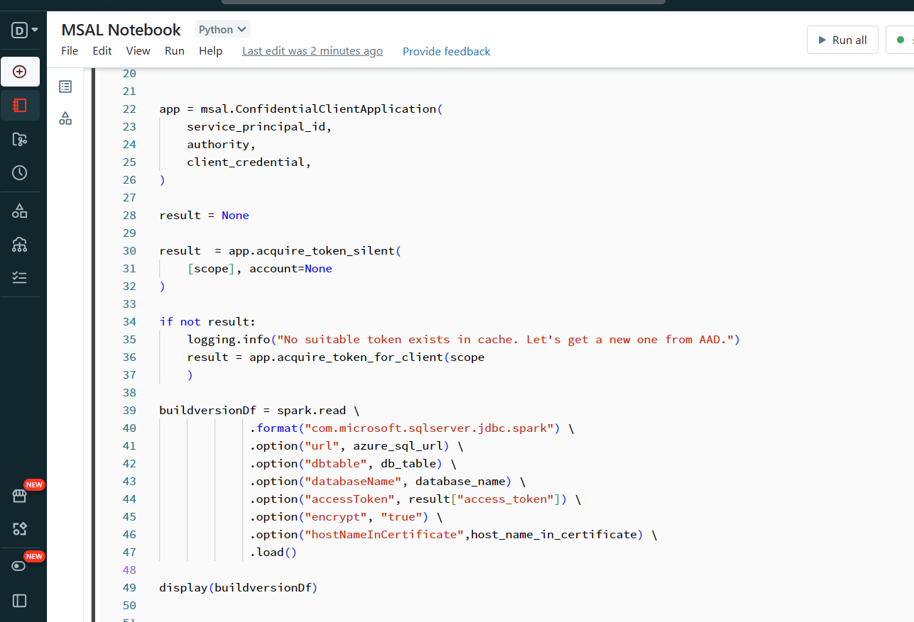
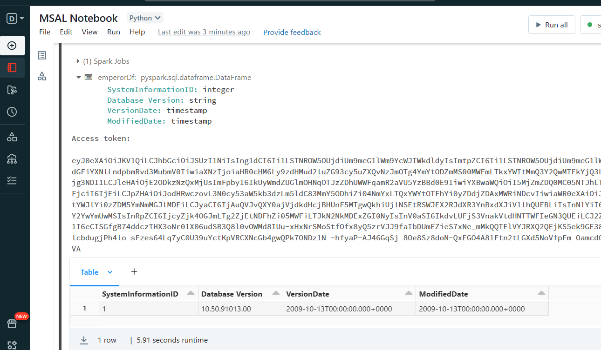

# Integrate Databricks to Azure SQL with MSAL using secret and certificates

MSAL provides different APIs depending on the client type being used. You may refer to the following [GitHub page](https://github.com/AzureAD/microsoft-authentication-library-for-python/wiki/Microsoft-Authentication-Client-Libraries/) for a detailed list of various APIs offered. We will use MSAL to authenticate with AAD and integrate our Databricks with SQL.



In the preceding diagram, the Databricks Notebook:

1. Acquires a token by using application secret credentials.
2. Uses the token to make requests of the resource (Azure SQL DB)

## App Registration

To register the application, navigate to Azure Active Directory and then click on App registration on the side panel. It’ll open up the App registration screen. When creating a new application, I always use a naming convention that is representative of what will be created, and in the example below I concatenate the application name, with the short name for the resource in Azure (Service Principal) which results in databricks-spn being created.



Once created, copy the Application ID value. You will then have to generate a secret, which is achieved by clicking on the generate a secret link in the sidebar. Generate a secret and copy the value as it will not be visible the next time you go back to the page.

## Write values to Key Vault

We write both the client Id and secret to Key Vault for a number of reasons.

1. The secret is sensitive and like a storage key or password, we don’t want this to be hardcoded or exposed anywhere in our application.
2. Normally we would have an instance of Databricks and Key Vault per environment and when we come to referencing the secrets, we want the secrets names to remain the same, so the code in our Databricks notebooks referencing the secrets doesn’t need to be modified when we deploy to different environments.

In the key vault, generate secrets that represent the values from the App Registration.

1. DatabricksSpnId (Client Id)
2. DatabricksSpnSecret (Client Secret)

## Azure SQL

The app still needs permission to log into Azure SQL and access the objects within it. You’ll need to Create that user (service principal) in the database and then grant it permissions on the underlying objects. In the example below I have given the service principal select permission on the dbo schema.



## Databricks

To connect to Azure SQL, you will need to install the [SQL Spark Connector](https://github.com/microsoft/sql-spark-connector) and the [Microsoft Authentication Library (MSAL) for Python](https://github.com/AzureAD/microsoft-authentication-library-for-python).

It’ll take a couple of moments and the libraries will be installed. Also, if you haven’t already, Create a secret scope to your Key Vault where your client Id, secret, and tenant Id have been generated. I called mine defaultScope.

So now we are ready to roll. The first screenshot shows the configuration pieces to connect to Azure SQL:

1. The retrieval of the service principal, secret, and tenant id from Key Vault.
2. My database URL, database, and table I want to collect to

   

All very well, but we want to get to our Build versions. The following snippet shows the follwoing

1. Retrieves an authentication token from Active Directory which our application is registered.
2. Creates a data frame containing our build versions using the config and authentication token we retrieved
3. Displays our data frame containing our build versions

   

   So there we are. We connected to Azure SQL using a service principal which gives us a lot more control over the activities that are taking place in our Databricks notebooks.

   

## Python Example with Service Principal

```csharp
import msal
import logging

resource_app_id_url = "https://database.windows.net/"

service_principal_id = dbutils.secrets.get(scope="defaultScope",key="DatabricksSpnId")
service_principal_secret = dbutils.secrets.get(scope="defaultScope",key="DatabricksSpnSecret")
tenant_id = dbutils.secrets.get(scope="defaultScope",key="TenantId")
authority = "https://login.windows.net/" + tenant_id
scope ="https://database.windows.net/.default"

azure_sql_url = "jdbc:sqlserver://sebichondodbserver.database.windows.net"
database_name = "testdb"
db_table = "[dbo].[BuildVersion]"

encrypt = "true"
host_name_in_certificate = "*.database.windows.net"

# Create a preferably long-lived app instance which maintains a token cache.
app = msal.ConfidentialClientApplication(
    service_principal_id,
    authority,
    client_credential,
)

# The pattern to acquire a token looks like this.
result = None

# Firstly, looks up a token from cache
# Since we are looking for token for the current app, NOT for an end user,
# notice we give account parameter as None.
result  = app.acquire_token_silent(
    [scope], account=None
)

if not result:
    logging.info("No suitable token exists in cache. Let's get a new one from AAD.")
    result = app.acquire_token_for_client(scope
    )

if "access_token" in result:
    print("Access token:\n")
    print(result["access_token"])
else:
    print(result.get("error"))
    print(result.get("error_description"))
    print(result.get("correlation_id"))  # You may need this when reporting a bug

buildversionDf = spark.read \
             .format("com.microsoft.sqlserver.jdbc.spark") \
             .option("url", azure_sql_url) \
             .option("dbtable", db_table) \
             .option("databaseName", database_name) \
             .option("accessToken", result["access_token"]) \
             .option("encrypt", "true") \
             .option("hostNameInCertificate",host_name_in_certificate) \
             .load()

display(buildversionDf)
```

## Scala Example with Service Principal

```csharp
%scala
import com.microsoft.aad.msal4j._
import java.util.Collections
import com.microsoft.azure.sqldb.spark.config.Config
import com.microsoft.azure.sqldb.spark.connect._

var accessToken = ""
val tenantId =  dbutils.secrets.get(scope="defaultScope",key="TenantId")
val authority = "https://login.microsoftonline.com/" + tenantId
val resourceAppIdURI = "https://database.windows.net/.default"

val ServicePrincipalId =dbutils.secrets.get(scope = secretScope, key = DatabricksSpnId)
val ServicePrincipalPwd =dbutils.secrets.get(scope = secretScope, key = DatabricksSpnSecret)

val ClientCred = ConfidentialClientApplication.builder(ServicePrincipalId,
  ClientCredentialFactory.createFromSecret(ServicePrincipalPwd)).authority(authority).build()
val clientCredentialParam = ClientCredentialParameters.builder(Collections.singleton(resourceAppIdURI)).build()

println(">>> Acquiring Access Token ..")
accessToken = ClientCred.acquireToken(clientCredentialParam).get().accessToken()
println("accessToken ---->> " + accessToken)

val config = Config(Map(
  "url"                   -> "sebichondodbserver.database.windows.net",
  "databaseName"          -> "testdb",
  "dbTable"               -> "[dbo].[BuildVersion]",
  "accessToken"           -> accessToken,
  "hostNameInCertificate" -> "*.database.windows.net",
  "encrypt"               -> "true"
))

val collection = sqlContext.read.sqlDB(config)
collection.show()

```
